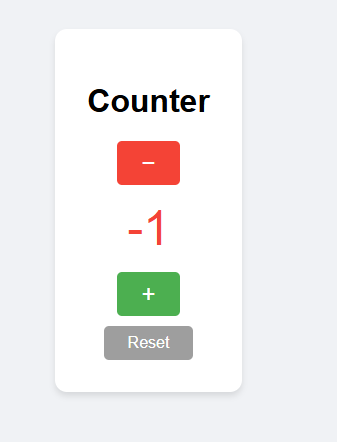

# 🧮 Counter – Mini Progetto JavaScript

Un semplice **contatore interattivo** sviluppato in **HTML, CSS e JavaScript**, con salvataggio automatico del valore tramite **LocalStorage**.  
Il progetto è stato realizzato come esercizio pratico come verifica aquisizione conoscena basi di JavaScript alll'interno del Master FSD realizzato da start2impact.

---

## 🚀 Demo Online

👉 **Prova l’applicazione qui:**  
https://giacorsa.github.io/counter/

---

## 📸 Screenshot

Ecco un’anteprima dell’applicazione:



---

## 📂 Struttura del Progetto

counter/
   index.html
   screenshot.png
   README.md
   css/
      style.css
   js/
      script,js

---

## 🧠 Funzionalità

- Incremento del contatore (+)
- Decremento del contatore (−)
- Reset del valore
- Salvataggio automatico tramite **LocalStorage**
- Colore del numero che diventa **rosso** se il valore è negativo
- Interfaccia semplice, pulita e responsive

---

## 🛠️ Tecnologie Utilizzate

- **HTML5**
- **CSS3**
- **JavaScript Vanilla**
- **LocalStorage API**

---

## 📜 Come eseguire il progetto in locale

1. Clona il repository:
   ```bash
   git clone https://github.com/giacorsa/counter.git

2. Entra nella cartella counter:
cd counter

3.
Apri index.html nel browser.

# counter
repository per esercitazione javascript

